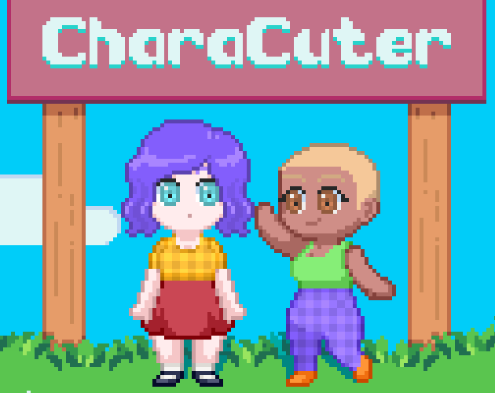
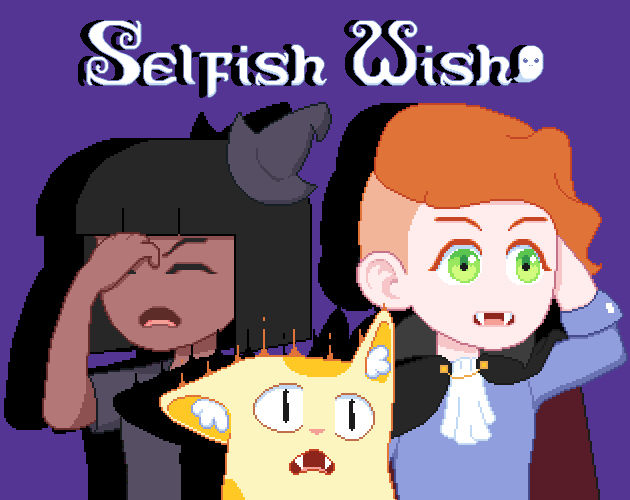

# Saudações 👋

<table border="0" width="100%">
<tr>
<td width="50%" valign="top">
Boas vindas à minha página de Jogos Independentes. Aqui eu quero mostrar um pouco do meu hobby com a Godot Engine, o motor principal onde me dedico à criação de universos digitais e mecânicas interativas.
  

- 🤔 **Neurodivergente** perdida entre os neurotípicos
- 🔭 Focando no meu **TCC em Engenharia de Software**
- 🌱 E estudando **Direito Previdenciário**
- 👯 Colaboro em projetos na **Godot Engine**
- 🌟 Interesse especial em **SABER / APRENDER**
- 💝 Grata aos canais de manhwa (**Segurança em 1° lugar!**)
- 😄 Curiosidade: Sou atriz profissional, administradora e desenvolvedora
</td>

<td width="25%" valign="top" align="center" style="border: none;">

*Crie um personagem grátis no CharaCuter*
</td>
<td width="25%" valign="top" align="center" style="border: none;">

*Conheça meu jogo piloto - Selfish Wish*
</td>
</tr>
</table>

---
